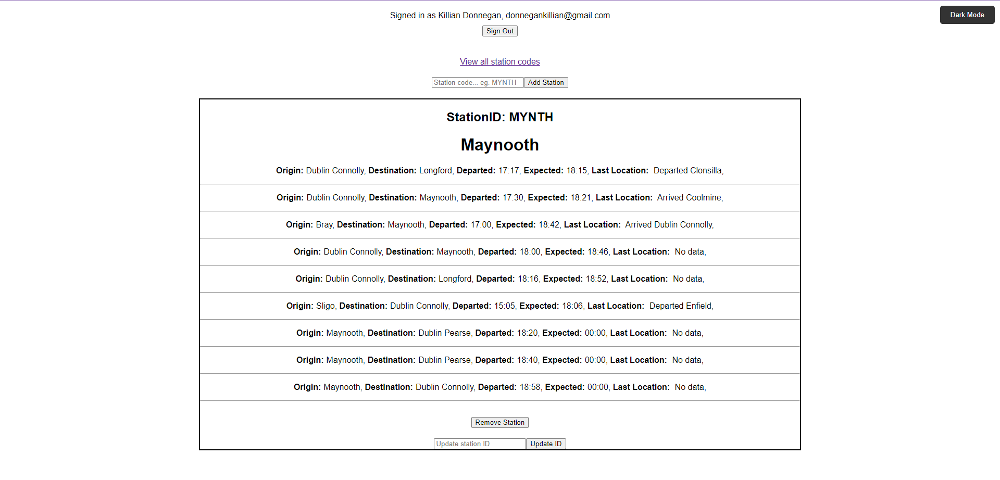

# TrainTimes
## Description
A full stack web application built primarily to aid and develop my learning of React, appearance and UI/UX weren't the main focus so aren't perfect. The project consists of a ReactJS frontend, a Firestore database, and a serverless function hosted on Netlify (as Irish Rail API does not support CORS). Users can login via Google Authentication, from there they can add station(s) by their station code and receive realtime data about trains passing to, from and through that station. The station code is saved and linked with their userID in the Firestore database which means when the user revisits the app data from their stations will automatically be on display. The user can also remove a station, and update the station code.

## Technologies Used
* ReactJS
* NodeJS
* ExpressJS
* Firebase / Firestore
* Netlify
* Irish Rail API

## Design
### Frontend
Frontend developed with ReactJS using the create-react-app boiler plate.

### Backend
#### Serverless Function
Hosted on Netlify, handles external API requests, fetching real-time train data from the Irish Rail API. It acts as a proxy to the Irish Rail API which isn't CORS enabled.

#### Database
Firestore database - app provides CRUD (Create, Read, Update, Delete) functionality to the database.
